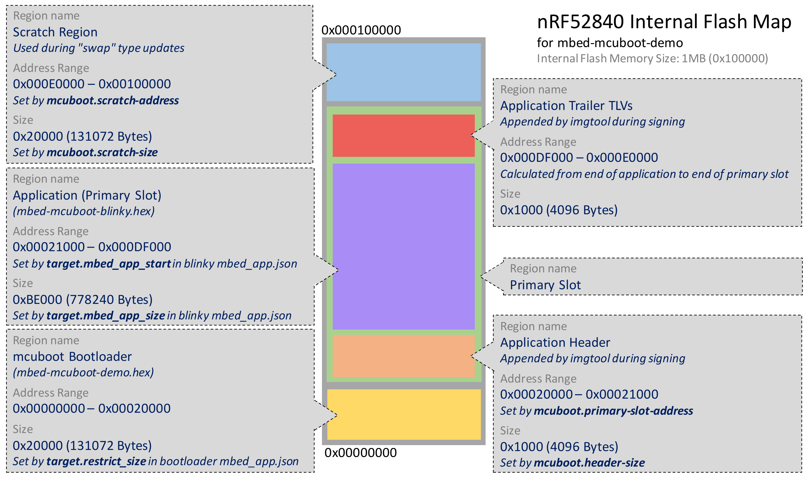

# mbed-mcuboot-demo
Demo of mcuboot with Mbed-OS

This application builds as a bootloader and should be built with the [corresponding bootable blinky demo application](https://github.com/AGlass0fMilk/mbed-mcuboot-blinky).

## Overview

Go to the [mcuboot repository](https://github.com/mcu-tools/mcuboot) for more information on mcuboot and how to configure it. This section will only cover topics specific to the mbed-os implementation.

## Memory Regions Overview

The diagram below shows the default memory map configuration used for this mcuboot demo on the nRF52840. The nRF52840 has a total of 1MB of internal program flash. The following sections detail how the bounds of each memory region is configured.



### Bootloader
The bootloader (the application in this repository) lives in the first region of flash where the processor begins execution. The basic mcuboot bootloader does not implement any interfaces to receive updates. It simply looks at available application "slots". The application (or another bootloader) is responsible for loading application updates into a slot visible to the mcuboot bootloader. Update candidates are typically placed in the "secondary" flash region.

The bootloader has a maximum size set by `target.restrict_size`. In this example the bootloader is restricted to a size of `0x20000` bytes. This is way larger than required but allows the bootloader to be built with a debug profile during development. In production the bootloader size should be optimized based on your use case.

Upon bootup, mcuboot looks at two memory regions, one called the "primary slot" and the other called the "secondary slot", to determine if a firmware update is available and should be installed.

### Primary Slot Region

The **"primary slot"** region is typically located immediately following the end of the bootloader. The starting address of the primary slot can be configured using the parameter `mcuboot.primary-slot-address`. The primary slot begins with the application header and contains the bootable main application and trailer info. 

The primary slot typically ends where the "mcuboot scratch region" begins (see Scratch Space Region below). The size (and thus the end address) of the primary slot can be configured using the parameter `mcuboot.slot-size`. Note that this parameter also configures the expected size of the secondary slot region.

**Note:** If your application uses internal flash for data storage (eg: KVStore), you must carefully configure the memory regions allocated to the primary slot, the scratch region, and your application to ensure there are no conflicts.

#### Application Header Info

The application header info section is at the beginning of the "primary memory slot".

When deciding what to boot/update, the mcuboot bootloader looks at an installed application's header info, which is a special struct prepended to the application binary. It uses this header info to validate that there is a bootable image installed in the "slot".

By default, this header is configured to be 4kB in size. This can be adjusted using the configuration parameter `mcuboot.header_size`. **However,** due to the way the FlashIAP block device currently works while erasing, the header_size should be configured to be the size of an erase sector (4kB in the case of an nRF52840). Erasing using the FlashIAPBlockDevice only works if the given address is erase-sector aligned!

This header is prepended to the application binary during the signing process (explained later).

#### Primary Application

The primary application is the currently installed, bootable application. In this demo it is the `mbed-mcuboot-blinky` application. The application start address is configured using `target.mbed_app_start` and the size can be restricted using `target.mbed_app_size`. The primary application size **must** be restricted to avoid colliding with the scratch space region (if used)!

#### Application TLV Trailers

There are also type-length-value (TLV) encoded pieces of information following the application binary called the "application trailer". These TLV encoded values include things like a digital signature and SHA hash, among other things. Similar to the application header info, the tlv trailers are also appended to the application hex during signing.

The space reserved for the application TLV trailers is determined from other configuration parameters. The TLV trailers reside in the memory between the **end** of the *primary application* and the **end** of the *primary slot*. ie: The TLV trailers start at `target.mbed_app_start + target.mbed_app_size` and end at `mcuboot.primary-slot-address + mcuboot.slot-size`.

In our case, our configuration gives us:
`target.mbed_app_start + target.mbed_app_size = 0x21000 + 0xBE000 = 0xDF000 = TLV start address`
`mcuboot.primary-slot-address + mcuboot.slot-size = 0x20000 + 0xC0000 = 0xE0000 = TLV end address`
`TLV region size = 0xE0000 - 0xDF000 = 0x1000`

In most cases, 4kB will be plenty of room for the required TLV trailers. Enabling features such as update binary encryption increases the number of required TLV trailer entries and so you may need to adjust the size of the TLV trailer region based on your use case. During signing, the imgtool script will complain if there is not enough room for TLV trailers.

See the [mcuboot Image Trailer documentation](https://github.com/mcu-tools/mcuboot/blob/master/docs/design.md#image-trailer) for more information.

### Scratch Space Region

If configured as such, mcuboot can perform a "swap" update where it will copy the existing main application into the secondary memory region and the update candidate into the main application region. This allows mcuboot to revert the update in case of a serious firmware bug (ie: brick-proofs the update process). If the updated application fails to mark itself as "okay", mcuboot will revert the update upon the next boot cycle. 

To perform this kind of swap update, mcuboot requires a non-volatile "scratch" space in memory to store pieces of application code and update status information. This enables mcuboot to safely continue an update/revert procedure in the event of a power loss.

The scratch region starting address may be specified with the configuration parameter, `mcuboot.scratch-address`. The size of the scratch space can be configured using `mcuboot.scratch-size` -- this value **must** be erase-sector aligned (ie: a multiple of the internal flash's eraseable size).


### Secondary Slot Region

The **"secondary"** slot region is provided by you. Typically this is an external flash chip used for bulk data and firmware update storage.

The function, `mbed::BlockDevice* get_secondary_bd(void)` declared in `secondary_bd.h`, is used by mcuboot to retrieve the `BlockDevice` instance it will use for the secondary slot. You **must** implement this function to build the bootloader _and_ the bootable application!

The returned BlockDevice is expected to have a size equivalent to the configuration `mcuboot.slot-size` as mentioned previously.

See the example file in this repository, `default_bd.cpp`.

Since the Mbed-OS mcuboot port uses Mbed's `BlockDevice` API, there is a lot of flexibility when providing the secondary memory region. For example, you can use a `FlashIAPBlockDevice` if your application is small enough to fit two copies in the internal flash. If you also use your external flash chip for data storage you can simply wrap the whole `BlockDevice` object in a `SlicingBlockDevice` to give mcuboot access to a certain region of your external flash.

## Additional Configuration

There are many configuration options available in mcuboot and these are covered in mcuboot's documentation. This section will go over basic configuration that needs to be done to boot an mbed-os application with mcuboot.

In the `mbed-mcuboot-blinky` repository, the mcuboot repository is included to allow the application to call some application-related mcuboot functions. One use case is having the application flag itself as "okay" after an update has occurred. This prevents mcuboot from reverting the update on the next boot.

By default, the mcuboot repository/library is configured to build a bootloader, **not** an application. So when building an application with mcuboot, it is important to add the following to your `mbed_app.json` configuration file:

```
"mcuboot.bootloader-build": 0
```

Other commonly-used configuration options are:
```
"target.restrict_size",
"target.mbed_app_start",
"target.mbed_app_size",
"mcuboot.primary-slot-address",
"mcuboot.slot-size",
"mcuboot.scratch-address",
"mcuboot.scratch-size",
"mcuboot.header-size",
"mcuboot.max-img-sectors",
"mcuboot.read-granularity",
```

Many of these have been mentioned previously. 

**NOTE:** It is important to ensure the `mcuboot` configuration parameters are **the same** for the bootloader and the bootable application!

## Running the Demo

The demo application prints the version number of the application installed in the primary slot at startup and then walks you through performing an update. After performing the update, the printed version number should change.

### Required tools: before you begin

It is beneficial to first install mcuboot's imgtool python command line tool:

`pip3 install --user -r mcuboot/scripts/requirements.txt && python3 mcuboot/scripts/setup.py install`

You should also install the python package `intelhex` if it is not already installed: `pip install intelhex`. This python package includes several utility scripts for working with binaries and .hex files.

### Creating the signing keys and building the bootloader

This section will only cover steps specific to setting up this project with a signing key pair and signing a main application binary. For more advanced use cases and information, such as using alternative signing algorithms to rsa-2048, see the mcuboot documentation.

For this project the required steps to sign an application are:

1.) Generate an rsa2048 key pair: `imgtool keygen -k signing-keys.pem -t rsa-2048`

2.) Extract the public key into a C data structure so it can be built into the bootloader: 

`imgtool getpub -k signing-keys.pem >> signing_keys.c`

**Note:** The output of this command formats the variables to a specific name that is declared as an extern in mcuboot's sources. It must **not** be modified manually.

3.) Build the bootloader: `mbed compile`

### Building and signing the primary application

Build the main application. The corresponding main application example can be cloned from this repository: [mbed-mcuboot-blinky](https://github.com/AGlass0fMilk/mbed-mcuboot-blinky).

Briefly, the commands are (from the root directory of this repository):

```
git clone https://github.com/AGlass0fMilk/mbed-mcuboot-blinky.git ../mbed-mcuboot-blinky
cd ../mbed-mcuboot-blinky
mbed config root . && mbed deploy
mbed compile -t GCC_ARM -m NRF52840_DK
cp BUILD/NRF52840_DK/GCC_ARM/mbed-mcuboot-blinky.hex ../mbed-mcuboot-demo
cd &_
```

Make sure to adjust the above commands for your target and toolchain.

The next step is to sign the main application binary. 

**Note:** even if the internal main application is not verified (ie: the digital signature is not checked) this step **must** be performed so the appropriate application header info is prepended to the binary. mcuboot will not execute the internal main application if this header info is missing or corrupt.

```
imgtool sign -k signing-keys.pem --align 4 -v 1.2.3+4 --header-size 4096 --pad-header -S 0xC0000 mbed-mcuboot-blinky.hex signed.hex
```

Explanation of each option:

- `-k signing-keys.pem`: this specifies the file containing the keys used to sign/verify the application
- `--align 4`: this lets mcuboot know the intrinsic alignment of the flash (32-bits = 4 byte alignemtn)
- `-v 1.2.3+4`: this sets the version number of the application to 1.2.3+4 (major.minor.patch+build)
- `--header-size 4096`: this must be the same as the value specified in `mcuboot.header-size` configuration (4096 bytes by default)
- `--pad-header`: this tells imgtool to insert the entire header, including any necessary padding bytes.
- `-S 0xC0000`: this specifies the maximum size of the application ("slot size"). It **must** be the same as the configured `mcuboot.slot-size`!


### Creating the update binary

Now you must create and flash the update binary to the target's internal flash.

In real world situations, the application would use some other transport (such as UART or BLE) to load the update binary into the secondary block device directly. For the sake of simplicity, this demo simply has you program the update binary to a reserved region in the internal flash which is then copied over to the secondary slot block device.

To simulate a firmware update being loaded into the secondary block device, the `mbed-mcuboot-blinky` application copies a section of internal flash located at `mcuboot.primary-slot-address + 0x40000` with a size of `0x20000` to the provided secondary slot block device.

Creating the update binary is similar to how we created the initial signed primary application binary.

This time though, we increment the version number and reduce the slot size padding so the resulting update binary is as small as possible. This helps improve update speeds when performing updates over a real transport (UART, BLE, Cellular, etc).

To figure out the minimum slot size padding to be used we will use the `hexinfo.py` utility provided by the `intelhex` package. 

Execute the following: `hexinfo.py mbed-mcuboot-blinky.hex`.

You should see output similar to the following:

```
- file: 'mbed-mcuboot-blinky.hex'
  data:
  - { first: 0x00021000, last: 0x0002F67B, length: 0x0000E67C }
```

This tells us the total size of our application is `0xE67C`. The minimum slot size padding can then be determined by rounding this size up to the nearest erase sector size (for nRF52840 this is 4kB, or `0x1000`):

`0xE67C rounded up to nearest 0x1000 = 0xF000`

Then, we must add one more erase sector to this rounded up value to give us our minimum slot size padding:

`0xF000 + 0x1000 = 0x10000`

To create the update binary, you must first sign the application as we did before (using the new version number and slot padding size):

```
imgtool sign -k signing-keys.pem --align 4 -v 1.2.3+5 --header-size 4096 --pad-header -S 0x10000 mbed-mcuboot-blinky.hex signed-update.hex
```

This will create a signed update hex called `signed-update.hex`. 

The start address of the `signed-update.hex` is still at `mcuboot.primary-slot-address`. To place the update binary in the reserved memory region we will have to shift the start address of this hex file. If you're using GCC, this can be done with the following command:

```
arm-none-eabi-objcopy --change-addresses 0x40000 signed-update.hex signed-update.hex
```

This will overwrite the original `signed-update.hex` with one that has a starting address shifted up by `0x40000`

Other toolchains will have a similar utility to perform this step.

### Merging it all together

To be able to drag-and-drop program the whole demo together, it is necessary to merge all the hex files we created in the last steps together.

At this step, you should have created three hex files:
- mbed-mcuboot-demo.hex (the bootloader)
- signed.hex (the initial signed primary application)
- update-signed.hex (the signed update application)

To merge these three hex files together we will use the `hexmerge.py` utility from the `intelhex` package:

```
hexmerge.py -o merged.hex --no-start-addr BUILD/NRF52840_DK/GCC_ARM/mbed-mcuboot-demo.hex signed.hex signed-update.hex
```

This will merge the above three hex files into one called `merged.hex`. If you execute: `hexinfo.py merged.hex` you should see output similar to the following:

```
- file: 'merged.hex'
  data:
  - { first: 0x00000000, last: 0x0000F5C7, length: 0x0000F5C8 }
  - { first: 0x00020000, last: 0x0002F7CB, length: 0x0000F7CC }
  - { first: 0x00060000, last: 0x0006F7CB, length: 0x0000F7CC }
```

This confirms that the three hex files have been merged together.

**Note:** In real world cases, your update mechanism may require a raw binary file. The hex can be converted to a raw binary with the following command:

```
arm-none-eabi-objcopy -I ihex -O binary signed-update.hex signed-update.bin
```

### Start the demo

Program your Mbed board with the `merged.hex` file generated in the previous step. You can simply drag-and-drop the `merged.hex` file to the removable drive that shows up when you plug in your Mbed board.

Once your target has been programmed, open a serial terminal to view the debug output of the board: `mbed sterm`. Reset the board and you should see output similar to the following:

```
-- Terminal on /dev/ttyACM1 - 9600,8,N,1 ---
[INFO][BL]: Starting MCUboot
[INFO][MCUb]: Primary image: magic=good, swap_type=0x2, copy_done=0x1, image_ok=0x1
[INFO][MCUb]: Scratch: magic=unset, swap_type=0x1, copy_done=0x3, image_ok=0x3
[INFO][MCUb]: Boot source: none
[INFO][MCUb]: Swap type: none
[INFO][BL]: Booting firmware image at 0x21000

<Potentially random data from the UART>

[INFO][main]: Hello version 1.2.3+4
[INFO][main]: > Press button to erase secondary slot

```

### Erasing the secondary slot

By pressing the target's button (BUTTON1, if there are multiple), you will initiate erasure of the secondary slot block device in preparation for programming the update. You should see output similar to the following:

```
[INFO][main]: Erasing secondary BlockDevice...
[INFO][main]: Secondary BlockDevice erased
[INFO][main]: > Press button to copy update image to secondary BlockDevice
```

### Copying the update image

After pressing the button again, the application will copy the update binary loaded at `mcuboot.primary-slot-address + 0x40000` to the secondary slot block device (typically external flash memory).

You should see output similar to the following:

```
[INFO][main]: FlashIAPBlockDevice inited
[INFO][main]: > Image copied to secondary BlockDevice, press button to activate
```

### Activating the update

When performing an update, the application must tell the bootloader there is a pending update in the secondary slot. After pressing the button again, the application calls the following mcuboot utilty function: `boot_set_pending(false);`

This causes the bootloader to check the secondary slot for a valid update binary.

You should see output similar to the following:

```
[DBG ][MCUb]: writing magic; fa_id=1 off=0xbfff0 (0xbfff0)
[DBG ][MCUb]: writing swap_info; fa_id=1 off=0xbffd8 (0xbffd8), swap_type=0x2 image_num=0x0
[INFO][main]: > Secondary image pending, reboot to update
```

### Performing the update

Now all you need to do to perform the update is reset your Mbed board! The mcuboot bootloader will then take over and perform the update automatically. You should see output similar to the following:

```
[INFO][BL]: Starting MCUboot
[INFO][MCUb]: Primary image: magic=unset, swap_type=0x1, copy_done=0x3, image_ok=0x3
[INFO][MCUb]: Scratch: magic=unset, swap_type=0x1, copy_done=0x3, image_ok=0x3
[INFO][MCUb]: Boot source: primary slot
[INFO][MCUb]: Swap type: test
[DBG ][MCUb]: erasing scratch area
[DBG ][MCUb]: initializing status; fa_id=2
[DBG ][MCUb]: writing swap_info; fa_id=2 off=0x1ffd8 (0xfffd8), swap_type=0x2 image_num=0x0
[DBG ][MCUb]: writing swap_size; fa_id=2 off=0x1ffd0 (0xfffd0)
[DBG ][MCUb]: writing magic; fa_id=2 off=0x1fff0 (0xffff0)
[DBG ][MCUb]: erasing trailer; fa_id=0
[DBG ][MCUb]: initializing status; fa_id=0
[DBG ][MCUb]: writing swap_info; fa_id=0 off=0xbffd8 (0xdffd8), swap_type=0x2 image_num=0x0
[DBG ][MCUb]: writing swap_size; fa_id=0 off=0xbffd0 (0xdffd0)
[DBG ][MCUb]: writing magic; fa_id=0 off=0xbfff0 (0xdfff0)
[DBG ][MCUb]: erasing trailer; fa_id=1
[DBG ][MCUb]: writing copy_done; fa_id=0 off=0xbffe0 (0xdffe0)
[INFO][BL]: Booting firmware image at 0x21000

<Potentially random data from the UART>

[INFO][main]: Boot confirmed
[INFO][main]: Hello version 1.2.3+5
[INFO][main]: > Press button to erase secondary slot
```

Notice that the reported version number has changed! The update was performed successfully.

**Note:** After an update is performed, the new application must mark itself as "okay" to the mcuboot bootloader. If this does not occur, mcuboot will revert the update upon the next reboot (if configured to do so).

The blinky application in this demo always does this at startup:

```
int ret = boot_set_confirmed();
```

In real world situations, your application should run a self test routine to ensure it can receive updates in the future (eg: the UART software works as expected, the BLE stack initializes successfully, etc).
