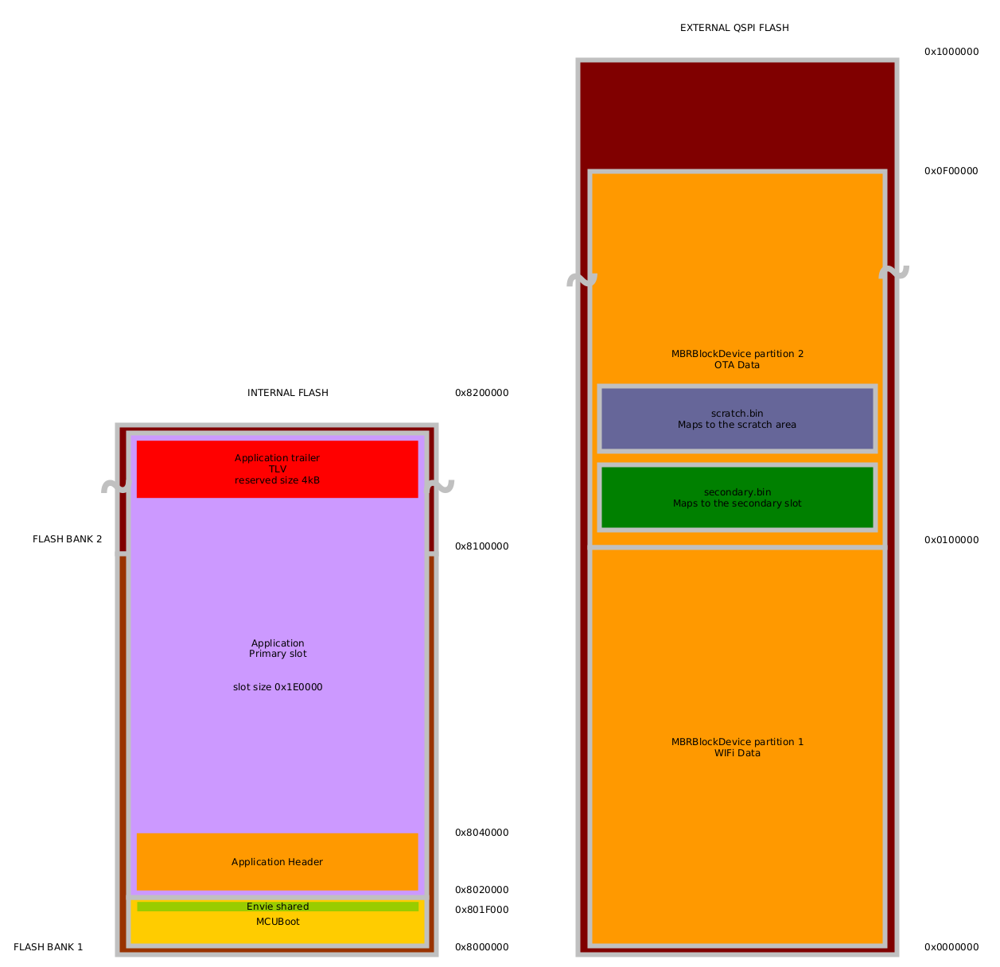

# MCUboot-portenta-boot
MCUBoot bootloader based on Mbed-OS for `PORTENTA_H7` target boards.

This application builds as a bootloader and should be used with the [corresponding core](https://github.com/bcmi-labs/ArduinoCore-mbed/tree/mcuboot).

## Prepare the board
At boot time by default MCUBoot will check for 2 "FileBlockDevices" into the QSPI flash. To prepare and format the QSPI flash as needed run this [sketch](https://github.com/bcmi-labs/mcuboot-portenta-boot/blob/boot_sketch/tools/PortentaMCUBootQSPIFormat.ino) before switching to MCUBoot.

## Upload MCUBoot bootloader
Different ways are available to switch to the new bootloader:

### JLink
Using JFlash or JFlashLite is possible to upload the MCUBoot bootloader binary to the board. The MCUBoot bootloader is stored at flash address `0x08000000`

### Arduino Sketch
Running this [sketch](https://github.com/bcmi-labs/mcuboot-portenta-boot/blob/boot_sketch/tools/PortentaMCUBootQSPIFormat.ino) will upload the last released MCUBoot bootloader to the board.


## Build from source

```
cd mcuboot-portenta-boot
mbed config root . && mbed deploy
mbed compile -m PORTENTA_H7_M7 -t GCC_ARM --profile=release --profile mbed-os/tools/profiles/extensions/lto.json
```

## Memory Regions Overview

The diagram below shows the default memory map configuration used for this mcuboot demo on the nRF52840. The nRF52840 has a total of 1MB of internal program flash. The following sections detail how the bounds of each memory region is configured.



### Bootloader
The bootloader (the application in this repository) lives in the first region of flash where the processor begins execution. The basic mcuboot bootloader does not implement any interfaces to receive updates. It simply looks at available application "slots". The application (or another bootloader) is responsible for loading application updates into a slot visible to the mcuboot bootloader. Update candidates are typically placed in the "secondary" flash region.

The bootloader has a maximum size set by `target.restrict_size`. In this project the bootloader is restricted to a size of `0x20000` bytes.

Upon bootup, mcuboot looks at two memory regions, one called the "primary slot" and the other called the "secondary slot", to determine if a firmware update is available and should be installed.

### Primary Slot Region

The **"primary slot"** region is typically located immediately following the end of the bootloader. The starting address of the primary slot can be configured using the parameter `mcuboot.primary-slot-address`. The primary slot begins with the application header and contains the bootable main application and trailer info. 

The primary slot typically ends where the "mcuboot scratch region" begins (see Scratch Space Region below). The size (and thus the end address) of the primary slot can be configured using the parameter `mcuboot.slot-size`. Note that this parameter also configures the expected size of the secondary slot region.

In this project primary slot starts at flash address `0x080400000` and slot size is `0xC0000`. Scratch region by default is placed on the external QSPI flash using a "FileBlockDevice".

**Note:** If your application uses internal flash for data storage (eg: KVStore), you must carefully configure the memory regions allocated to the primary slot, the scratch region, and your application to ensure there are no conflicts.

#### Application Header Info

The application header info section is at the beginning of the "primary memory slot".

When deciding what to boot/update, the mcuboot bootloader looks at an installed application's header info, which is a special struct prepended to the application binary. It uses this header info to validate that there is a bootable image installed in the "slot".

By default, this header is configured to be 4kB in size. This can be adjusted using the configuration parameter `mcuboot.header_size`. 

**However,** due to the way the FlashIAP block device currently works while erasing, the header_size should be configured to be the size of an erase sector (128kB in the case of an STM32H7). Erasing using the FlashIAPBlockDevice only works if the given address is erase-sector aligned!

This header is prepended to the application binary during the signing process (explained later).

#### Primary Application

The primary application is the currently installed, bootable application and it must be buid with the [corresponding core](https://github.com/bcmi-labs/ArduinoCore-mbed/tree/mcuboot).


#### Application TLV Trailers

There are also type-length-value (TLV) encoded pieces of information following the application binary called the "application trailer". These TLV encoded values include things like a digital signature and SHA hash, among other things. Similar to the application header info, the TLV trailers are also appended to the application hex during signing.

The space reserved for the application TLV trailers is determined from other configuration parameters. The TLV trailers reside in the memory between the **end** of the *primary application* and the **end** of the *primary slot*. 

ie: The TLV trailers start at `target.mbed_app_start + target.mbed_app_size` and end at `mcuboot.primary-slot-address + mcuboot.slot-size`.

In our case, our configuration gives us:

`target.mbed_app_start + target.mbed_app_size =  = TLV start address`

`mcuboot.primary-slot-address + mcuboot.slot-size =  = TLV end address`

`TLV region size =  -  = `

### Scratch Space Region

If configured as such, mcuboot can perform a "swap" update where it will copy the existing main application into the secondary memory region and the update candidate into the main application region. This allows mcuboot to revert the update in case of a serious firmware bug (ie: brick-proofs the update process). If the updated application fails to mark itself as "okay", mcuboot will revert the update upon the next boot cycle. 

To perform this kind of swap update, mcuboot requires a non-volatile "scratch" space in memory to store pieces of application code and update status information. This enables mcuboot to safely continue an update/revert procedure in the event of a power loss.

The scratch region starting address may be specified with the configuration parameter, `mcuboot.scratch-address`. The size of the scratch space can be configured using `mcuboot.scratch-size` -- this value **must** be erase-sector aligned (ie: a multiple of the internal flash's eraseable size).

For more advanced information about configuring the scratch space region, see the [mcuboot documentation on Image Slots](https://github.com/mcu-tools/mcuboot/blob/master/docs/design.md#image-slots). For more information on swap updates, see the [mcuboot documentation on Swap Updates](https://github.com/mcu-tools/mcuboot/blob/master/docs/design.md#image-swapping)

### Secondary Slot Region

The **"secondary"** slot region is provided by you. Typically this is an external flash chip used for bulk data and firmware update storage.

The function, `mbed::BlockDevice* get_secondary_bd(void)` declared in `secondary_bd.h`, is used by mcuboot to retrieve the `BlockDevice` instance it will use for the secondary slot. You **must** implement this function to build the bootloader _and_ the bootable application!

The returned BlockDevice is expected to have a size equivalent to the configuration `mcuboot.slot-size` as mentioned previously.
